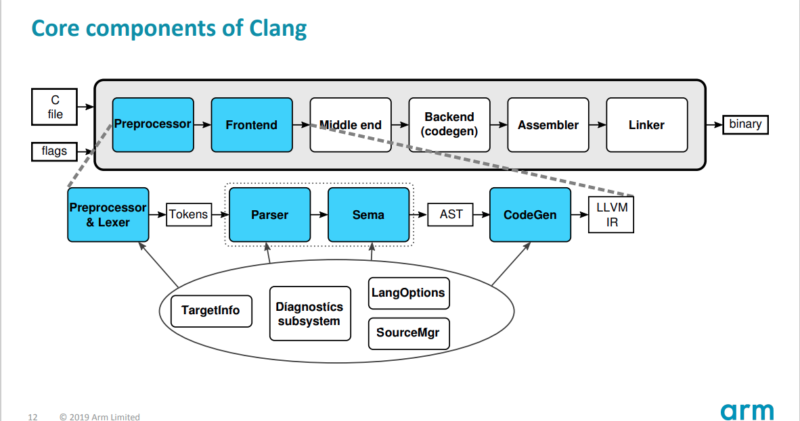
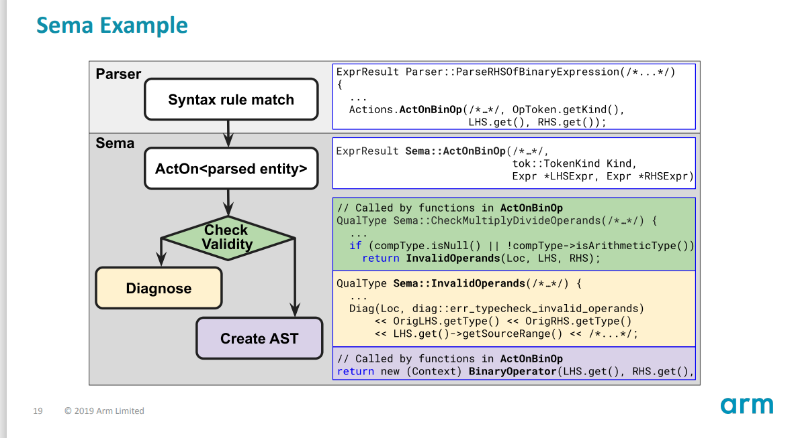

# all kinds of notes about llvm


## [An Overview of Clang](https://llvm.org/devmtg/2019-10/slides/ClangTutorial-Stulova-vanHaastregt.pdf)

core consists of 830k lines of code plus 33k lines of TableGen definitions.

- Phases combined into tool executions.
- Driver invokes the frontend (cc1), linker, … with the appropriate flags.

clang.c
```c
int main(int argc, char *argv[]){
  
  return 0;
}
```


```sh
clang -ccc-print-phases factorial.c
```

```
➜  clan  clang -ccc-print-phases clang.c
            +- 0: input, "clang.c", c
         +- 1: preprocessor, {0}, cpp-output
      +- 2: compiler, {1}, ir
   +- 3: backend, {2}, assembler
+- 4: assembler, {3}, object
5: linker, {4}, image


➜  clan clang -### clang.c
clang version 10.0.0-4ubuntu1
Target: x86_64-pc-linux-gnu
Thread model: posix
InstalledDir: /usr/bin
 "/usr/lib/llvm-10/bin/clang" "-cc1" "-triple" "x86_64-pc-linux-gnu" "-emit-obj" "-mrelax-all" "-disable-free" "-disable-llvm-verifier" "-discard-value-names" "-main-fi
le-name" "clang.c" "-mrelocation-model" "static" "-mthread-model" "posix" "-mframe-pointer=all" "-fmath-errno" "-fno-rounding-math" "-masm-verbose" "-mconstructor-alias
es" "-munwind-tables" "-target-cpu" "x86-64" "-dwarf-column-info" "-fno-split-dwarf-inlining" "-debugger-tuning=gdb" "-resource-dir" "/usr/lib/llvm-10/lib/clang/10.0.0"
 "-internal-isystem" "/usr/local/include" "-internal-isystem" "/usr/lib/llvm-10/lib/clang/10.0.0/include" "-internal-externc-isystem" "/usr/include/x86_64-linux-gnu" "-
internal-externc-isystem" "/include" "-internal-externc-isystem" "/usr/include" "-fdebug-compilation-dir" "/home/maritns3/test/clan" "-ferror-limit" "19" "-fmessage-len
gth" "0" "-fgnuc-version=4.2.1" "-fobjc-runtime=gcc" "-fdiagnostics-show-option" "-fcolor-diagnostics" "-faddrsig" "-o" "/tmp/clang-76120f.o" "-x" "c" "clang.c"
 "/usr/bin/ld" "-z" "relro" "--hash-style=gnu" "--build-id" "--eh-frame-hdr" "-m" "elf_x86_64" "-dynamic-linker" "/lib64/ld-linux-x86-64.so.2" "-o" "a.out" "/usr/bin/..
/lib/gcc/x86_64-linux-gnu/9/../../../x86_64-linux-gnu/crt1.o" "/usr/bin/../lib/gcc/x86_64-linux-gnu/9/../../../x86_64-linux-gnu/crti.o" "/usr/bin/../lib/gcc/x86_64-linu
x-gnu/9/crtbegin.o" "-L/usr/bin/../lib/gcc/x86_64-linux-gnu/9" "-L/usr/bin/../lib/gcc/x86_64-linux-gnu/9/../../../x86_64-linux-gnu" "-L/usr/bin/../lib/gcc/x86_64-linux-
gnu/9/../../../../lib64" "-L/lib/x86_64-linux-gnu" "-L/lib/../lib64" "-L/usr/lib/x86_64-linux-gnu" "-L/usr/lib/../lib64" "-L/usr/lib/x86_64-linux-gnu/../../lib64" "-L/u
sr/bin/../lib/gcc/x86_64-linux-gnu/9/../../.." "-L/usr/lib/llvm-10/bin/../lib" "-L/lib" "-L/usr/lib" "/tmp/clang-76120f.o" "-lgcc" "--as-needed" "-lgcc_s" "--no-as-need
ed" "-lc" "-lgcc" "--as-needed" "-lgcc_s" "--no-as-needed" "/usr/bin/../lib/gcc/x86_64-linux-gnu/9/crtend.o" "/usr/bin/../lib/gcc/x86_64-linux-gnu/9/../../../x86_64-lin
ux-gnu/crtn.o"
```

```
➜  clan clang -c -Xclang -dump-tokens clang.c
int 'int'        [StartOfLine]  Loc=<clang.c:1:1>
identifier 'main'        [LeadingSpace] Loc=<clang.c:1:5>
l_paren '('             Loc=<clang.c:1:9>
int 'int'               Loc=<clang.c:1:10>
identifier 'argc'        [LeadingSpace] Loc=<clang.c:1:14>
comma ','               Loc=<clang.c:1:18>
char 'char'      [LeadingSpace] Loc=<clang.c:1:20>
star '*'         [LeadingSpace] Loc=<clang.c:1:25>
identifier 'argv'               Loc=<clang.c:1:26>
l_square '['            Loc=<clang.c:1:30>
r_square ']'            Loc=<clang.c:1:31>
r_paren ')'             Loc=<clang.c:1:32>
l_brace '{'             Loc=<clang.c:1:33>
return 'return'  [StartOfLine] [LeadingSpace]   Loc=<clang.c:3:3>
numeric_constant '0'     [LeadingSpace] Loc=<clang.c:3:10>
semi ';'                Loc=<clang.c:3:11>
r_brace '}'      [StartOfLine]  Loc=<clang.c:4:1>
eof ''          Loc=<clang.c:4:2>
```

Tokens declared in include/clang/Basic/TokenKinds.def
Token is consumed by include/clang/Parse/Parser.h


Sema
- Tight coupling with parser 
- Biggest client of the Diagnostics subsystem.

Diagnostics subsystem
- Purpose: communicate with human through diagnostics:
- Defined in `Diagnostic*Kinds.td` TableGen files.
- Emitted through helper function Diag().

```
➜  clan  clang -c -Xclang -ast-dump clang.c
TranslationUnitDecl 0x23025d8 <<invalid sloc>> <invalid sloc>
|-TypedefDecl 0x2302e70 <<invalid sloc>> <invalid sloc> implicit __int128_t '__int128'
| `-BuiltinType 0x2302b70 '__int128'
|-TypedefDecl 0x2302ee0 <<invalid sloc>> <invalid sloc> implicit __uint128_t 'unsigned __int128'
| `-BuiltinType 0x2302b90 'unsigned __int128'
|-TypedefDecl 0x23031e8 <<invalid sloc>> <invalid sloc> implicit __NSConstantString 'struct __NSConstantString_tag'
| `-RecordType 0x2302fc0 'struct __NSConstantString_tag'
|   `-Record 0x2302f38 '__NSConstantString_tag'
|-TypedefDecl 0x2303280 <<invalid sloc>> <invalid sloc> implicit __builtin_ms_va_list 'char *'
| `-PointerType 0x2303240 'char *'
|   `-BuiltinType 0x2302670 'char'
|-TypedefDecl 0x2303578 <<invalid sloc>> <invalid sloc> implicit __builtin_va_list 'struct __va_list_tag [1]'
| `-ConstantArrayType 0x2303520 'struct __va_list_tag [1]' 1
|   `-RecordType 0x2303360 'struct __va_list_tag'
|     `-Record 0x23032d8 '__va_list_tag'
`-FunctionDecl 0x2362470 <clang.c:1:1, line:4:1> line:1:5 main 'int (int, char **)'
  |-ParmVarDecl 0x2362238 <col:10, col:14> col:14 argc 'int'
  |-ParmVarDecl 0x2362350 <col:20, col:31> col:26 argv 'char **':'char **'
  `-CompoundStmt 0x2362598 <col:33, line:4:1>
    `-ReturnStmt 0x2362588 <line:3:3, col:10>
      `-IntegerLiteral 0x2362568 <col:10> 'int' 0
```

AST Visitors
- `RecursiveASTVisitor` for visiting the full AST.
- `StmtVisitor` for visiting Stmt and Expr.
- `TypeVisitor` for visiting Type hierarchy.

CodeGen
- Not to be confused with LLVM CodeGen! (which generates machine code)
- Uses AST visitors, IRBuilder, and TargetInfo.
- CodeGenModule class keeps global state, e.g. LLVM type cache.
  Emits global and some shared entities.
- CodeGenFunction class keeps per function state.
- Emits LLVM IR for function body statements.

clang -S -emit-llvm -o - clang.c

```
➜  clan clang -S -emit-llvm -o - clang.c
; ModuleID = 'clang.c'
source_filename = "clang.c"
target datalayout = "e-m:e-p270:32:32-p271:32:32-p272:64:64-i64:64-f80:128-n8:16:32:64-S128"
target triple = "x86_64-pc-linux-gnu"

; Function Attrs: noinline nounwind optnone uwtable
define dso_local i32 @main(i32 %0, i8** %1) #0 {
  %3 = alloca i32, align 4
  %4 = alloca i32, align 4
  %5 = alloca i8**, align 8
  store i32 0, i32* %3, align 4
  store i32 %0, i32* %4, align 4
  store i8** %1, i8*** %5, align 8
  ret i32 0
}

attributes #0 = { noinline nounwind optnone uwtable "correctly-rounded-divide-sqrt-fp-math"="false" "disable-tail-calls"="false" "frame-pointer"="all" "less-precise-fpm
ad"="false" "min-legal-vector-width"="0" "no-infs-fp-math"="false" "no-jump-tables"="false" "no-nans-fp-math"="false" "no-signed-zeros-fp-math"="false" "no-trapping-mat
h"="false" "stack-protector-buffer-size"="8" "target-cpu"="x86-64" "target-features"="+cx8,+fxsr,+mmx,+sse,+sse2,+x87" "unsafe-fp-math"="false" "use-soft-float"="false"
 }

!llvm.module.flags = !{!0}
!llvm.ident = !{!1}

!0 = !{i32 1, !"wchar_size", i32 4}
!1 = !{!"clang version 10.0.0-4ubuntu1 "}
```

From a developer’s perspecƟve:

cmake ... -DLLVM_ENABLE_PROJECTS='clang ' ...
make

Under the hood:
1. Builds clang-tblgen.
2. Runs clang-tblgen to get .inc files from .td files.
3. Builds rest of Clang.




## [LLVM IR tutorial](https://llvm.org/devmtg/2019-04/slides/Tutorial-Bridgers-LLVM_IR_tutorial.pdf)

llvm-dis / llvm-as
