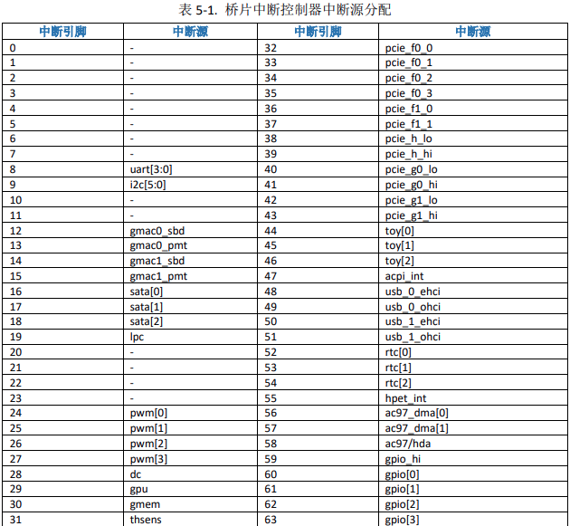

# 裸金属二进制翻译器的技术细节

- [文档](https://loongson.github.io/LoongArch-Documentation/README-CN.html)

## Serial
从这里找信息:
https://github.com/loongson-community/docs

## file
https://www.cs.cmu.edu/afs/cs/academic/class/15213-f12/www/lectures/12-linking.pdf

## 裸机中的注意点
- 串口
  - 频率
  - 中断控制器
- PCI bridge
- PCI hole
- `cpu_has_hypervisor` 包围的部分

如果看 7A1000 用户手册，似乎 uart 似乎是 8 号，而 QEMU 上测试显示是 2 号

但是实际上，串口走的是 legacy inct 的 10 位

# softmmu 和 memory model 的移植的设计

## 设计
- CPUAddressSpace 需要创建出来两个 AddressSpace 来
  - 但是 AddressSpace 共同的持有
  - 将两个 AddressSpace 和 smram `smram_region` 共同合作的，来确定 vag-low 还是 ram

- 需要 MemoryRegion，但是不需要 MemoryRegionSection，因为 MemoryRegion 中间不会被划分，MemoryRegion 就是最小的对象
- 一个 MemoryRegion 关联一个 RAMBlock，MemoryRegion 和 RAMBlock 的大小完全相同

1. segments 直接初始化为固定大小的数组
2. 所有的 MemoryRegion 在按照顺序排放
3. 使用二分查找来找到 MemoryRegion
4. 以后增加一个 mru 的 cache 维持生活这个样子的

- 对于 SMM 的处理，首先判断是否命中 SMM 空间
  - 常规路径
  - 查看是否是 SMM 的那个 MemoryRegion 的，如果是，再看 attrs 的结果

- 对于 0xfffff 下面的那些 memory region 都是直接静态的定义下来的

- 修改那些位置是需要进行 `tcg_commit` 的
  - 修改 AddressSpace::segments 的时候，也就是 `io_add_memory_region` 和 `mem_add_memory_region`
  - smm / pam 修改映射关系的时候，对应原来的代码  `memory_region_set_enabled` 会调用 `memory_region_transaction_commit` 的情况啊!

- pc.bios 的空间不是在 `ram_size` 中的，但是 1M 的 bios 是属于的

## TODO
- [ ] 处理一下各个 submodule 注册 memory region，比如 `fw_cfg`

- [ ] 确认一下 : SMM 状态的转换会删除掉所有的 TLB，不然 `iotlb_to_section` 还在使用第一次 TLB miss 注册的 attrs
- [ ] 现在将很多 MemoryRegion 都切碎了，可能在原来的 QEMU 中是没有越界的，但是现在出现了越界
  - 只要在 MemoryRegion generated topology 不要让其

## 重写的函数接口
| function                          | 作用                                                                                                          |
|-----------------------------------|---------------------------------------------------------------------------------------------------------------|
| `address_space_translate_for_iotlb` | 根据 addr 得到 memory region 的                                                                               |
| `memory_region_section_get_iotlb`   | 计算出来当前的 section 是 `AddressSpaceDispatch` 中的第几个 section, 之后就可以通过 addr 获取 section 了        |
| `qemu_map_ram_ptr`                  | 这是一个神仙设计的接口，如果参数 `ram_block` 的接口为 NULL, 那么 addr 是 ram addr， 如果不是，那么是 ram 内偏移 |
| `cpu_addressspace`                  |                                                                                                               |
| `iotlb_to_section`                  |                                                                                                               |

#### 真的需要移除掉 iotlb 机制吗
而 IOTLB 的 MMIO 移除掉，让 `io_readx` 和 `io_writex` 中直接走 memory region translate 的操作

需要修改的内容，将其尽可能变为空的:
- `memory_region_section_get_iotlb`
- `address_space_translate_for_iotlb` : 只是进行 RAM 装换就好了，那么这些就是
- `iotlb_to_section`

#### `address_space_translate_for_iotlb` 和 `address_space_translate` 的关系
- `address_space_translate`
  - `address_space_to_flatview` : 获取 Flatview
  - `flatview_translate` : 返回 MemoryRegionSection
    - `flatview_do_translation`
      - `flatview_to_dispatch` : 从 Flatview 获取 dispatch
        - `address_space_translate_internal`
    - 从 MemoryRegionSection 获取 mr

- `address_space_translate_for_iotlb`
  - `atomic_rcu_read(&cpu->cpu_ases[asidx].memory_dispatch)` : 直接获取 dispatch
  - `address_space_translate_internal`

| function                            | para                                            | res                       |
|-------------------------------------|-------------------------------------------------|---------------------------|
| `address_space_translate_for_iotlb` | [cpu asidx](获取地址) addr [attrs prot](没用的) | MemoryRegionSection, xlat |
| `address_space_translate`           | as, addr, [`is_write attrs`](没用的)                | MemoryRegion, xlat, len   |
| `address_space_translate_internal`  | d, addr, `resolve_subpage`                      | xlat, plen                |

## 到底那些地方可以简化
- `stl_le_phys` 族的函数只是需要这一个
- `memory_ldst.h` 无需考虑 `#define SUFFIX                   _cached_slow`, 那是给 virtio 使用的
- 几乎无需处理 endianness 的问题
