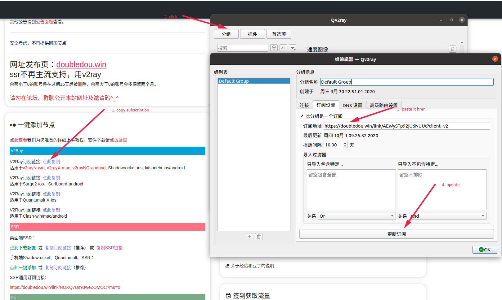
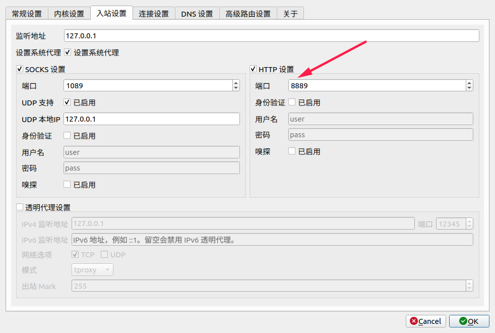

# How to cross Great Fire Wall

## Caveat
Only tested on Ubuntu20, but should work in all linux distribution, and similar approach can be used for macos and windows.

## Abstract
If you can't clone https://github.com/torvalds/linux in minutes, this article is what you need.


| method | airport(机场) | client                                     |
|--------|---------------|--------------------------------------------|
| v2ray  | v2e.fun       | [qv2ray](https://github.com/Qv2ray/Qv2ray) |


## setup
You can reference [document of qv2ray](https://qv2ray.net/en/getting-started/) for details, here is simplified steps.

1. install `v2ray core` and `qv2ray` 
```
snap install v2ray
snap install qv2ray
```
2. [config `v2ray core` in `qv2ray`](https://qv2ray.net/en/getting-started/step2.html#download-v2ray-core-files)

3. get subscription:
    1. [百度搜索机场](https://www.baidu.com/s?wd=%E6%9C%BA%E5%9C%BA%E8%AF%84%E6%B5%8B&rsv_spt=1&rsv_iqid=0xc4db450f00001a08&issp=1&f=8&rsv_bp=1&rsv_idx=2&ie=utf-8&tn=baiduhome_pg&rsv_enter=1&rsv_dl=tb&rsv_n=2&rsv_sug3=1&rsv_sug1=1&rsv_sug7=100&rsv_sug2=0&rsv_btype=i&inputT=457&rsv_sug4=458)
    2. select your favorite airport
    3. follows instructions provided by airports, such as register, charge, then your will get your subscription
4. add subscription to qv2ray:


:grinning: **Now you can access Google.com** :grinning:

## terminal proxy
```sh
export http_proxy=http://127.0.0.1:8889 && export https_proxy=http://127.0.0.1:8889 
```

**8889 is the port set in qv2ray.**




## git proxy 
for details, look [this](https://github.com/v2ray/v2ray-core/issues/1190).
```sh
git config --global http.proxy http://127.0.0.1:8889
git config --global https.proxy https://127.0.0.1:8889
```
**8889 is the port set in qv2ray.**

To avoid password everytime push to remote.
```sh
git config --global credential.helper store                        
```
