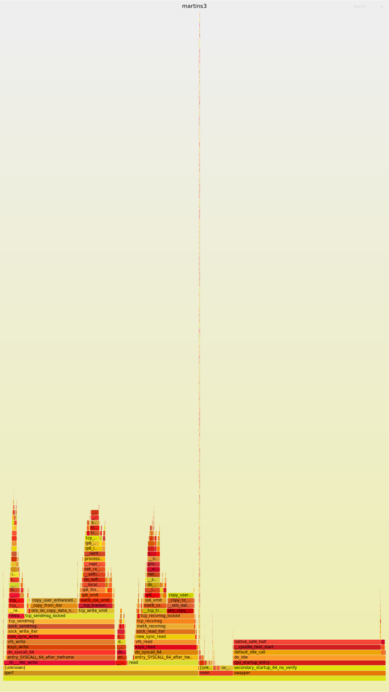

# loopback 网卡

分析一下:


## [ ] 没有看到 `raise_softirq` 的调用
- `raise_softirq` 和 `do_softirq` 的调用数量是对等的吗？
- 物理网卡中，`raise_softirq` 是发生在的中断处理函数中，但是在 loopback 网卡中，是发生在哪里的？

## [ ] `net_tx_action` 会调用到 `napi_poll` 上，既然是没有中断的，为什么还是需要中断聚合的

## [ ] CPU A 和 CPU B 使用 softirq 通信，不使用 RPS 的时候，如果 CPU C 使用网络栈的内容，会导致 softirq 迁移吗

## [ ] What is the main difference between RSS, RPS and RFS
- https://stackoverflow.com/questions/44958511/what-is-the-main-difference-between-rss-rps-and-rfs

- 调用 `raise_softirq` 100% 是时钟中断触发的。
- `__raise_softirq_irqoff` 是真正插入 flag 的位置:

从 `ip6_finish_output2` 的位置开始，关闭和打开 softirq 的:

```txt
__raise_softirq_irqoff+1
enqueue_to_backlog+642
netif_rx_internal+58
__netif_rx+20
loopback_xmit+201
dev_hard_start_xmit+217
__dev_queue_xmit+2199
ip6_finish_output2+705
ip6_xmit+1048
inet6_csk_xmit+215
__tcp_transmit_skb+1333
tcp_write_xmit+830
tcp_sendmsg_locked+1283
tcp_sendmsg+40
sock_sendmsg+65
sock_write_iter+151
new_sync_write+371
vfs_write+521
ksys_write+167
do_syscall_64+59
entry_SYSCALL_64_after_hwframe+68
```

```txt
sk_filter_trim_cap+270
tcp_v6_rcv+3100
ip6_protocol_deliver_rcu+205
ip6_input_finish+64
__netif_receive_skb_one_core+99
process_backlog+137
__napi_poll+44
net_rx_action+571
__softirqentry_text_start+238
do_softirq.part.0+152
__local_bh_enable_ip+115
ip6_finish_output2+499
ip6_xmit+1048
inet6_csk_xmit+215
__tcp_transmit_skb+1333
tcp_write_xmit+830
tcp_sendmsg_locked+1283
tcp_sendmsg+40
sock_sendmsg+65
sock_write_iter+151
new_sync_write+371
vfs_write+521
ksys_write+167
do_syscall_64+59
entry_SYSCALL_64_after_hwframe+68
```

任何一次 softirq
