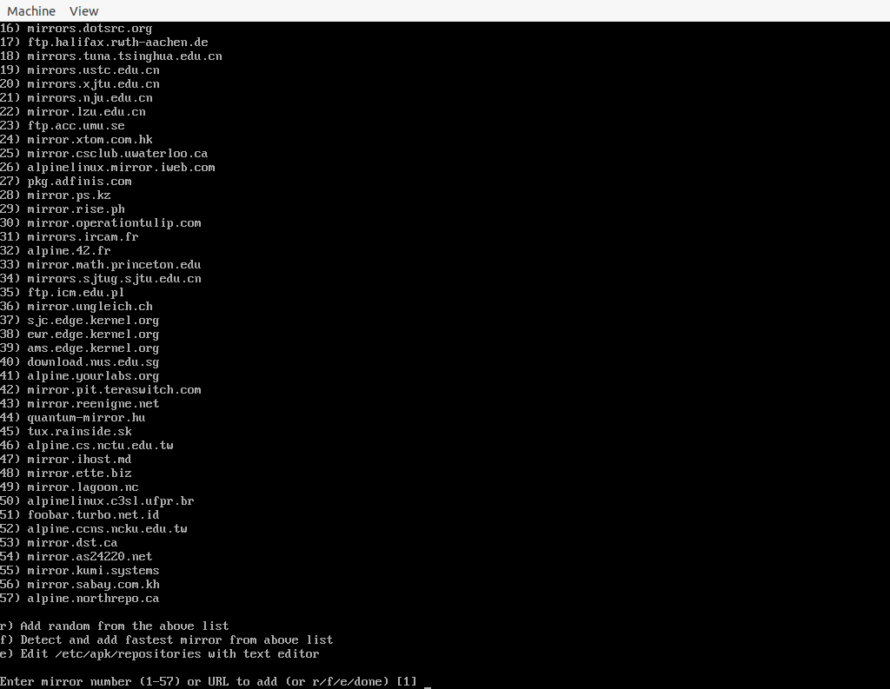

# QEMU 的基本使用方法
QEMU 的功能这里大致介绍一下

## 如何编译 QEMU
QEMU 支持的选项很多，通过下面的命令来查看：
```sh
../configure --help
```

想要运行 32 位的 x86 操作系统，编译参数为:
```sh
mkdir 32bit
cd 32bit || exit 1
../configure --target-list=i386-softmmu
make -j
```

编译运行在 ARM 上的 QEMU:
```sh
../configure --target-list=aarch64-softmmu --disable-werror
```

在 x86 上交叉编译 ARM QEMU，感觉很难，放弃。

## 基本使用方法
**各种脚本都是在这里: https://github.com/Martins3/Martins3.github.io/blob/master/docs/qemu/sh/**
- config.json 中保存配置，设置内核和 QEMU 路径，以及各种镜像保存的位置
- basic.sh : QEMU 的集中基本用法
- initrd.sh : 将 init 进程设置为 hello
- busybox.sh : [busybox](https://busybox.net)
- alpine.sh ubuntu.sh windows.sh yocto.sh : 运行各种 Linux 发行版
- bridge.sh : 测试添加一个 PCIe bridge

## 运行各种 Distribution

### Basic
- [script](https://github.com/Martins3/Martins3.github.io/blob/master/docs/qemu/sh/yocto.sh)

使用 yocto 作为镜像，并且使用不同的参数演示 QEMU 的使用

### Hello World
- [script](https://github.com/Martins3/Martins3.github.io/blob/master/docs/qemu/sh/initrd.sh)

参考:
- https://ibugone.com/blog/2019/04/os-lab-1/
- https://www.kernel.org/doc/html/latest/filesystems/ramfs-rootfs-initramfs.html

其中，init 不仅仅可以是 elf 格式的程序，还是可以是 shell 的，例如

需要注意的是，其运行参数为
```bash
arg_kernel_args="console=ttyS0 root=/dev/ram rdinit=/hello.out"
```
这是因为我们的程序名称为 hello.out ，如果将 hello.out 修改为 init，那么就无需使用额外的参数了。

### Alpine
- [script](https://github.com/Martins3/Martins3.github.io/blob/master/docs/qemu/sh/alpine.sh)

因为这个脚本就是我日常使用的，总是在其中测试各种 QEMU 和 Linux 的特性，有点复杂，如果一时难以接受，可以查看下面的几个脚本。

简单解释几个点:
1. 其中采用 alpine 作为镜像，因为 alpine 是 Docker 选择的轻量级镜像，比 Yocto 功能齐全(包管理器)，而且比 Ubuntu 简单。
2. 第一步使用 iso 来安装镜像，这次运行的是 iso 中是包含了一个默认内核, 安装镜像之后，使用 -kernel 指定内核
3. 在 [How to use custom image kernel for ubuntu in qemu?](https://stackoverflow.com/questions/65951475/how-to-use-custom-image-kernel-for-ubuntu-in-qemu) 的这个问题中，我回答了如何设置内核参数 sda

其中几乎所有的操作使用脚本，除了镜像的安装需要手动操作
1. 使用 root 登录
2. 执行 setup-alpine 来进行安装, 所有的都是默认的, 一路 enter (包括密码，之后登录直接 enter) ，除了下面的两个
    - 选择 image 的时候让其自动选择最快的，一般是清华的
    - 安装磁盘选择创建的

> 默认 root 登录


> 选择 aliyun，或者 f 自动选择最快的，


> 将系统安装到脚本制作的 image 中


构建好了之后，就可以像是调试普通进程一样调试内核了，非常地好用。而且 Alpine 自带包管理:
```sh
apk add pciutils
```


### busybox
- [script](https://github.com/Martins3/Martins3.github.io/blob/master/docs/qemu/sh/busybox.sh)

基础的部分参考这个：
- https://www.cnblogs.com/wipan/p/9272255.html
- https://gist.github.com/chrisdone/02e165a0004be33734ac2334f215380e

network 的事情参考这个部分：
- https://www.digi.com/resources/documentation/digidocs/90001515/task/yocto/t_configure_network.htm

### Ubuntu Desktop
- [script](https://github.com/Martins3/Martins3.github.io/blob/master/docs/qemu/sh/ubuntu.sh)

Ubuntu 需要首先安装，利用 iso 制作镜像，然后使用该镜像。

### Centos 8
- 注意安装的时候不要将盘搞成了 LVM 格式，否则 QEMU 的 -kernel 参数难以成功
- Centos 8 因为切换内核，无法使用网络

```txt
[martins3@localhost network-scripts]$ ls
ifcfg-ens3
[martins3@localhost network-scripts]$ ip addr
1: lo: <LOOPBACK,UP,LOWER_UP> mtu 65536 qdisc noqueue state UNKNOWN group default qlen 1000
    link/loopback 00:00:00:00:00:00 brd 00:00:00:00:00:00
    inet 127.0.0.1/8 scope host lo
       valid_lft forever preferred_lft forever
    inet6 ::1/128 scope host
       valid_lft forever preferred_lft forever
2: enp0s5: <BROADCAST,MULTICAST,UP,LOWER_UP> mtu 1500 qdisc pfifo_fast state UP group default qlen 1000
    link/ether 52:54:00:12:34:56 brd ff:ff:ff:ff:ff:ff
3: sit0@NONE: <NOARP> mtu 1480 qdisc noop state DOWN group default qlen 1000
    link/sit 0.0.0.0 brd 0.0.0.0
[martins3@localhost network-scripts]$
```

### Windows
- [script](https://github.com/Martins3/Martins3.github.io/blob/master/docs/qemu/sh/windows.sh)

当然，QEMU 也是可以运行 Windows 的

## Guest 网络

### 端口重定向
```sh
-netdev user,id=net0,hostfwd=tcp::8080-:80
```
将 Host 8080 端口重定向到 Guest 的 80 端口

<!-- TMP_TODO 的 - [ ]  -netdev user,id=net0,hostfwd=tcp::5556-:22 -->

### Guest 科学上网
有时候 Guest 中需要安装某些东西，没有代理几乎没有成功的可能性。在 Host 打开 Qv2ray 或者 Clash，设置为可以代理整个局域网，
然后获取 host 的 ip 地址，最后在 Guest 中运行一下命令即可。
```sh
export http_proxy=http://ip_addr:8889 && export https_proxy=http://ip_addr:8889
```

当然可以使用默认映射的 host 的 ip 地址:
```sh
export http_proxy=http://10.0.2.2:8889 && export https_proxy=http://10.0.2.2:8889
```

## 共享

### 9p
QEMU 启动参数增加
```sh
arg_share_dir="-virtfs local,path=${share_dir},mount_tag=host0,security_model=mapped,id=host0"
```

在 guest 中
```sh
mount -t 9p -o trans=virtio,version=9p2000.L host0 /mnt/9p
```

### ssh
在 host 通过 `ip addr` 获取 ip 地址，之后和普通的 ssh 使用起来没有差异。

在 guest 中可以直接 ssh host
```sh
ssh martins3@10.0.2.2
```
使用这个方法可以同步 host 的代码到 guest 中:
```sh
git clone martins3@10.0.2.2:path_to_repo
```

当然最方便的方法还是 sshfs

```sh
mkdir mnt
sshfs martins3@10.0.2.2:path_to_repo  ~/mnt
```

## [PCI bridge](https://github.com/Martins3/Martins3.github.io/blob/master/docs/qemu/sh/bridge.sh)

在 Guest 中，首先运行 `lspci`，观察到 00:03.0 是一个 PCI bridge
```plain
00:00.0 Host bridge: Intel Corporation 440FX - 82441FX PMC [Natoma] (rev 02)
00:01.0 ISA bridge: Intel Corporation 82371SB PIIX3 ISA [Natoma/Triton II]
00:01.1 IDE interface: Intel Corporation 82371SB PIIX3 IDE [Natoma/Triton II]
00:01.3 Bridge: Intel Corporation 82371AB/EB/MB PIIX4 ACPI (rev 03)
00:02.0 VGA compatible controller: Device 1234:1111 (rev 02)
00:03.0 PCI bridge: Red Hat, Inc. QEMU PCI-PCI bridge
00:04.0 SCSI storage controller: Red Hat, Inc. Virtio block device
00:05.0 Ethernet controller: Intel Corporation 82574L Gigabit Network Connection
00:06.0 Unclassified device [0002]: Red Hat, Inc. Virtio filesystem
01:01.0 Non-Volatile memory controller: Red Hat, Inc. QEMU NVM Express Controller (rev 02)
```

然后运行 `ls -l /sys/bus/pci/devices`，可以观察到 01:01.0 是挂载到 00:03.0 上的

```txt
lrwxrwxrwx    1 root     root             0 May 16 08:50 0000:00:00.0 -> ../../../devices/pci0000:00/0000:00:00.0
lrwxrwxrwx    1 root     root             0 May 16 08:50 0000:00:01.0 -> ../../../devices/pci0000:00/0000:00:01.0
lrwxrwxrwx    1 root     root             0 May 16 08:50 0000:00:01.1 -> ../../../devices/pci0000:00/0000:00:01.1
lrwxrwxrwx    1 root     root             0 May 16 08:50 0000:00:01.3 -> ../../../devices/pci0000:00/0000:00:01.3
lrwxrwxrwx    1 root     root             0 May 16 08:50 0000:00:02.0 -> ../../../devices/pci0000:00/0000:00:02.0
lrwxrwxrwx    1 root     root             0 May 16 08:50 0000:00:03.0 -> ../../../devices/pci0000:00/0000:00:03.0
lrwxrwxrwx    1 root     root             0 May 16 08:50 0000:00:04.0 -> ../../../devices/pci0000:00/0000:00:04.0
lrwxrwxrwx    1 root     root             0 May 16 08:50 0000:00:05.0 -> ../../../devices/pci0000:00/0000:00:05.0
lrwxrwxrwx    1 root     root             0 May 16 08:50 0000:00:06.0 -> ../../../devices/pci0000:00/0000:00:06.0
lrwxrwxrwx    1 root     root             0 May 16 08:50 0000:01:01.0 -> ../../../devices/pci0000:00/0000:00:03.0/0000:01:01.0
```

## vnc
有的系统是必须使用图形界面才可以安装的，例如 Ubuntu[^1]，此时只能使用 vnc 在远程打开:

参考 man qemu(1)
```txt
              host:d TCP connections will only be allowed from host on display d. By convention the TCP port is 5900+d. Optionally, host can be  omitted
                     in which case the server will accept connections from any host.

```

给启动参数添加上
```sh
vnc :0,password=on
```

在 mac 上可以使用连接:
```sh
open vnc://192.168.23.126:5900
```

注意：这里又一个小坑，那就是密码是必须的，然后在 QEMU 的 monitor 中设置密码:
```txt
(qemu) set_password vnc 123456
```

## 模拟 numa
内核内存管理中，numa 相关的代码是无处不在的，而一般只有在服务器中才有 numa 的机器，为了测试相关的代码，可以通过 QEMU 来模拟 numa 。


- https://futurewei-cloud.github.io/ARM-Datacenter/qemu/how-to-configure-qemu-numa-nodes/

## 删除 Guest 机器代码
参考[这里](https://askubuntu.com/questions/281074/can-i-set-my-user-account-to-have-no-password)

## TODO
- [ ] 利用 QEMU 给一个分区安装操作系统
- [ ] 內核启动参数中需要指定 root=/dev/sda3 如何确定

[^1]: https://askubuntu.com/questions/1108334/how-to-boot-and-install-the-ubuntu-server-image-on-qemu-nographic-without-the-g


<script src="https://giscus.app/client.js"
        data-repo="martins3/martins3.github.io"
        data-repo-id="MDEwOlJlcG9zaXRvcnkyOTc4MjA0MDg="
        data-category="Show and tell"
        data-category-id="MDE4OkRpc2N1c3Npb25DYXRlZ29yeTMyMDMzNjY4"
        data-mapping="pathname"
        data-reactions-enabled="1"
        data-emit-metadata="0"
        data-theme="light"
        data-lang="zh-CN"
        crossorigin="anonymous"
        async>
</script>

本站所有文章转发 **CSDN** 将按侵权追究法律责任，其它情况随意。
