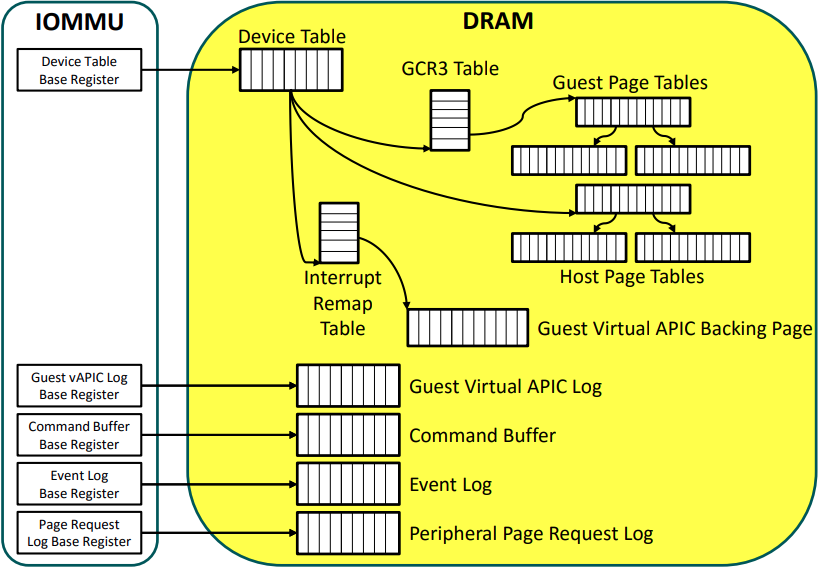
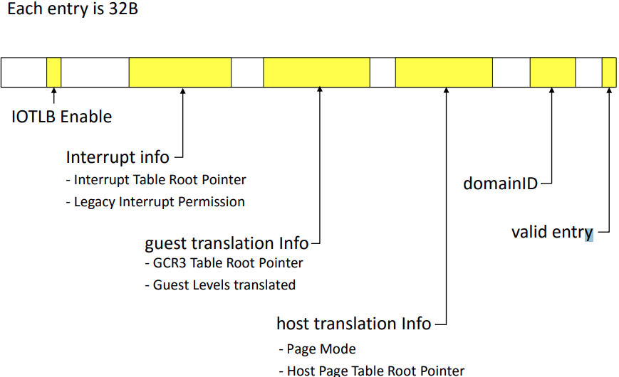
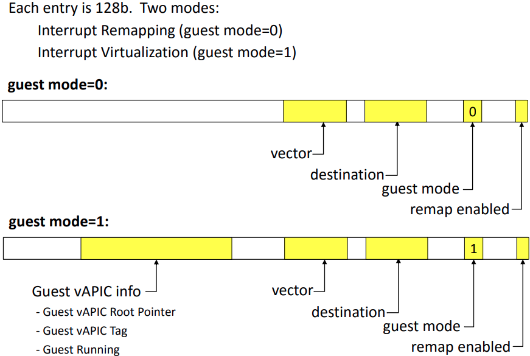

# IOMMU

## 问题 && TODO
- [ ] drivers/iommu/hyperv-iommu.c 是个什么概念 ?
- [ ] vCPU 支持
  - [ ] iommu 可以支持嵌套虚拟化吗 ?
- [ ] virtio iommu 是做什么的，和 vIOMMU 是什么关系?
- [ ] 能不能 hacking 一个 minimal 的用户态 nvme 驱动，能够读取一个 block 上来的那种

- VFIO 中，是如何处理中断的

## https://events19.linuxfoundation.cn/wp-content/uploads/2017/11/Shared-Virtual-Addressing_Yisheng-Xie-_-Bob-Liu.pdf

## [isca_iommu_tutorial](http://pages.cs.wisc.edu/~basu/isca_iommu_tutorial/IOMMU_TUTORIAL_ASPLOS_2016.pdf)

> Extraneous IPI adds overheads => Each extra interrupt can add 5-10K cycles ==> Needs dynamic remapping of interrupts

似乎是 core 1 setup 了 io device 的中断，那么之后，io device 的中断到其他的 core 都需要额外的 ipi.
然后使用 iommu 之后，这个中断 remap 的事情不需要软件处理了

在异构计算中间，可以实现 GPU 共享 CPU 的 page table 之后，获取相同的虚拟地址空间。

> IOMMU IS PART OF PROCESSOR COMPLEX

io device 经过各级 pci hub 到达 root complex,  进入 iommu 翻译，然后到达 mmu controller

> Better solution: IOMMU remaps 32bit device physical
> address to system physical address beyond 32bit
> ‒ DMA goes directly into 64bit memory
> ‒ No CPU transfer
> ‒ More efficient

>  If access occurs, OS gets notified and can shut the device & driver down and notifies the user or administrator

> Some I/O devices can issue DMA requests to system memory
> directly, without OS or Firmware intervention
> ‒ e.g.,1394/Firewire, network cards, as part of network boot
> ‒ That allows attacks to modify memory before even the OS has a chance to protect against the attacks

> IOMMU redirects device physical address set up by Guest OS driver (= Guest Physical Addresses) to the actual Host System Physical Address (SPA)

> Some memory copies are gone, because the same memory is accessed
>
> ‒ But the memory is not accessible concurrently, because of cache policies
>
> Two memory pools remain (cache coherent + non-coherent memory regions)
>
> Jobs are still queued through the OS driver chain and suffer from overhead
>
> Still requires expert programmers to get performance

> IOMMU Driver (running on CPU) issues commands to IOMMU
> ‒ e.g., Invalidate IOMMU TLB Entry, Invalidate IOTLB Entry
> ‒ e.g., Invalidate Device Table Entry
> ‒ e.g., Complete PPR, Completion Wait , etc.
>
> Issued via Command Buffer
> ‒ Memory resident circular buffer
> ‒ MMIO registers: Base, Head, and Tail register

> 
> device remapping table
> 
> interrupt remapping table
> 

最后，其中的补充文章可以看看，了解一下业界的工作内容。比如:
- http://web.cs.ucla.edu/~haoyc/pdf/hpca17.pdf

## https://kernelgo.org/intel_iommu.html
- 解释了一下 intel iommu 启动的过程

## https://kernelgo.org/interrupt-remapping.html

- https://zhuanlan.zhihu.com/p/372385232 ：分析了初始化的过程

- 在 guest 中以为持有了某一个设备，那么如何才可以真正的使用

这两个函数正好描述了 MSI 的样子:
- `__irq_msi_compose_msg` 是普通的 irq 组装的样子
- linux/drivers/iommu/intel/irq_remapping.c 中的 fill_msi_msg

- [ ] 是不是只有在直通的时候，interrupt remapping 才需要，似乎打开 IOMMU 和使用 interrupt remapping 不是总是绑定的?

```c
static const struct irq_domain_ops intel_ir_domain_ops = {
    .select = intel_irq_remapping_select,
    .alloc = intel_irq_remapping_alloc,
    .free = intel_irq_remapping_free,
    .activate = intel_irq_remapping_activate,
    .deactivate = intel_irq_remapping_deactivate,
};
```

在其中 intel_irq_remapping_alloc 的位置将会来创建 IRTE


在 intel_setup_irq_remapping 中，调用 arch_get_ir_parent_domain
```c
/* Get parent irqdomain for interrupt remapping irqdomain */
static inline struct irq_domain *arch_get_ir_parent_domain(void)
{
    return x86_vector_domain;
}
```


## https://kernelgo.org/posted-interrupt.html


## 有趣

intremap=nosid

- https://www.reddit.com/r/linuxquestions/comments/8te134/what_do_nomodeset_intremapnosid_and_other_grub/
- https://www.greenbone.net/finder/vt/results/1.3.6.1.4.1.25623.1.0.870999
- https://serverfault.com/questions/1077297/ilo4-and-almalinux-centos8-do-not-work-properly

## AMD 手册
- https://www.amd.com/system/files/TechDocs/48882_IOMMU.pdf

## vfio interrupt

- https://stackoverflow.com/questions/29461518/interrupt-handling-for-assigned-device-through-vfio
  - 中断让 vfio 机制来注册

- [ ] 还是需要使用 bpftrace 来分析一下吧
