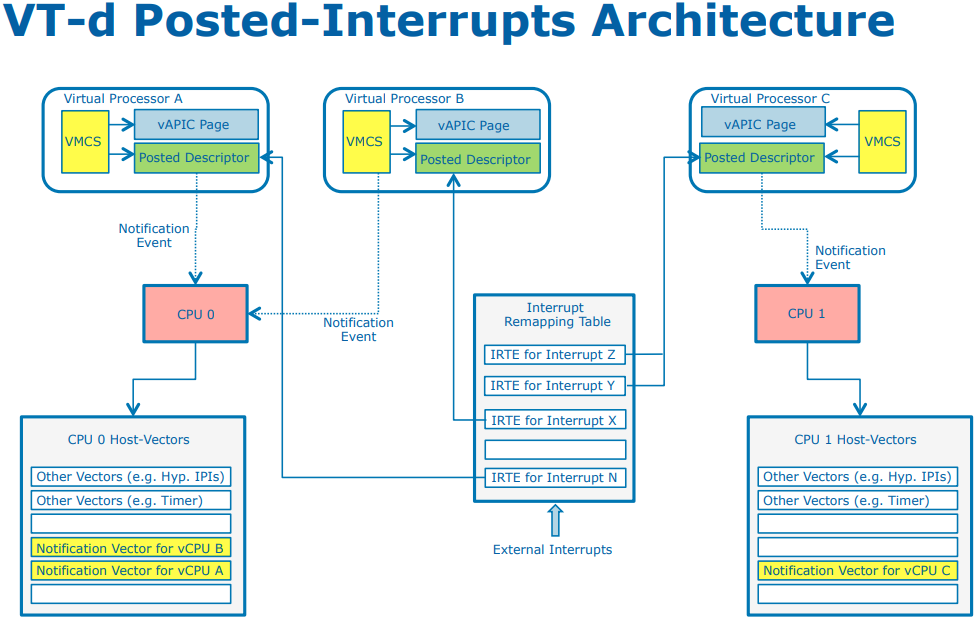

# VT-d
How to enable `IRQ_REMAP` in `make menuconfig`:
Device Drivers ==> IOMMU Hareware Support ==> Support for Interrupt Remapping

intel_setup_irq_remapping ==> iommu_set_irq_remapping, setup `Interrupt Remapping Table Address Register` which hold address **IRET** locate [^3] 163,164

好家伙，才意识到 ITRE 其实存在两种格式，remapped interrupt 的格式下，其功能相当于 IO-APIC 的功能，作为设备和 CPU 之间的联系，而 Posted-interrupt 的格式下，就是我们熟悉的内容。
在 Posted-interrupt 格式下，IRET 中间没有目标 CPU 等字段，而是 posted-interrupt descriptor 的地址

### 5 Interrupt Remapping
This chapter discuss architecture and hardware details for interrupt-remapping and interruptposting.These features collectively are called the interrupt remapping architecture.

## my question
- [ ] mmio 可以 remap 吗 ?
- [ ] dma engine 是一个需要的硬件支持放在哪里了 ?
- [ ] 怎么知道一个设备在进行 dma ?
  - [x] 一个真正的物理设备，当需要发起 dma 的时候，进行的 IO 地址本来应该在 pa, 由于 vm 的存在，实际上是在 gpa 上，需要进行在 hpa 上

## [VT-d Posted Interrupts](https://events.static.linuxfound.org/sites/events/files/slides/VT-d%20Posted%20Interrupts-final%20.pdf)
1. Motivation
  - Interrupt virtualization efficiency
  - *Interrupt migration complexity*
  - *Big requirement of host vector for different assigned devices*

- [ ] migration ?
- [ ] host **vector** for different assigned devices ?

Xen Implementation Details:
- Update IRET according to guest’s modification to the interrupt configuration (MSI address, data)
- Interrupt migration during VCPU scheduling

[^3]: Inside the Linux Virtualization : Principle and Implementation
