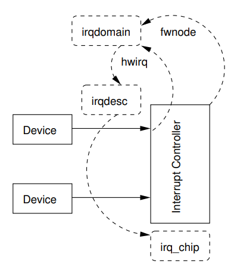
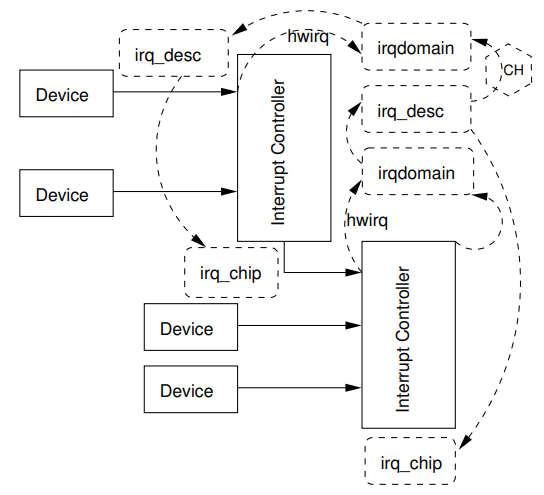

# kernel/irq
> 缺乏相关的背景内容，根本没有办法动笔!

| file           | blank | comment | code | explanation |
|----------------|-------|---------|------|-------------|
| manage.c       | 309   | 678     | 1271 |             |
| irqdomain.c    | 242   | 412     | 1107 |             |
| chip.c         | 217   | 390     | 843  |             |
| irqdesc.c      | 157   | 127     | 661  |             |
| generic-chip.c | 92    | 144     | 412  |             |
| proc.c         | 92    | 52      | 385  |             |
| msi.c          | 76    | 92      | 357  |             |
| internals.h    | 73    | 60      | 348  |             |
| matrix.c       | 55    | 121     | 280  |             |
| spurious.c     | 58    | 160     | 247  |             |
| debugfs.c      | 45    | 8       | 220  |             |
| ipi.c          | 45    | 112     | 182  |             |
| affinity.c     | 44    | 44      | 182  |             |
| devres.c       | 39    | 98      | 150  |             |
| settings.h     | 27    | 5       | 137  |             |
| pm.c           | 32    | 56      | 124  |             |
| timings.c      | 41    | 197     | 124  |             |
| cpuhotplug.c   | 24    | 86      | 106  |             |
| handle.c       | 35    | 86      | 101  |             |
| irq_sim.c      | 25    | 43      | 95   |             |
| autoprobe.c    | 21    | 71      | 92   |             |
| migration.c    | 18    | 45      | 56   |             |
| resend.c       | 11    | 41      | 48   |             |
| debug.h        | 8     | 5       | 36   |             |
| dummychip.c    | 7     | 21      | 36   |             |
| Makefile       | 1     | 1       | 15   |             |


为什么设备是复杂的 ?
1. 利用构建 vfs 提供访问设备的接口，同时block 设备又是 fs 的载体
2. module 系统
3. 中断 系统

https://unix.stackexchange.com/questions/47306/how-does-the-linux-kernel-handle-shared-irqs

## question
1. irq_data 的作用 ?
2. 


## todo
1. 以 x86 为例，想知道从 architecture 的 entry.S 触发 到指向对应的 handler 的过程是怎样的 ?
2. 中断控制器很简单，其大概是怎么实现的 ?
    1. CPU 提供给 interrupt controller 的接口是什么 ?
        1. 我(CPU) TM 怎么知道这一个信号是来自于 interrupt controller 的 ?
        2. 是不是 CPU 专门为其提供了引脚，各种CPU 的引脚的数量是什么 ?
        3. IC 的输入输出的引脚的数量是多少 ?
    2. 当 IC 可以进行层次架构之后，

3. 为了多核，是不是也是需要进一步修改 IC 来支持。
    1. affinity 提供硬件支持

4. http://wiki.0xffffff.org/posts/hurlex-8.html 可以阅读的资料

## Documentation

An IRQ number is an enumeration of the possible interrupt sources on a
machine.  Typically what is enumerated is the number of input pins on
all of the interrupt controller in the system.  In the case of ISA
what is enumerated are the 16 input pins on the two i8259 interrupt
controllers.
> 曾经以为 IRQ number 是 CPU 的 input，原来只是 interrupt controller 的输入，那么其中

## wowotech 相关的内容

1. 中断描述符中应该会包括底层irq chip相关的数据结构，linux kernel中把这些数据组织在一起，形成`struct irq_data`
2. 中断有两种形态，一种就是直接通过signal相连，用电平或者边缘触发。另外一种是基于消息的，被称为MSI (Message Signaled Interrupts)。
3. Interrupt controller描述符（struct irq_chip）包括了若干和具体Interrupt controller相关的`callback`函数


## [IRQs: the Hard, the Soft, the Threaded and the Preemptible](https://elinux.org/images/8/8c/Zyngier.pdf)

> An interrupt controller allows them to be multiplexed

我想知道 controller 如何实现 multiplexed 的，或者 multiplexed 到底指什么东西 ? interrupt 队列 ?

> Offers specific facilities
> - Masking/unmasking individual interrupts
> - Setting priorities
> - SMP affinity
> - Exotic things like wake-up interrupts

> Interrupt triggers
> - Level triggered (high or low)
>   - Indicates a persistent condition
>   - An action has to be performed on the device to clear the interrupt
> - Edge triggered (rising or falling)
>   - Indicates an event
>   - May have happened once or more...
> - Some systems do not expose the trigger type to software
>   - Either the interrupt is abstracted (virtualization)
>   - Or this is more an exception than an interrupt...

> How does Linux deal with interrupts
> - `struct irq_chip`
>     - A set of methods describing how to drive the interrupt controller
>     - Directly called by core IRQ code
> - `struct irqdomain`
>     - A pointer to the firmware node for a given interrupt controller (`fwnode`)
>     - A method to convert a firmware description of an IRQ into an ID local to this interrupt controller (`hwirq`)
>     - A way to retrieve the Linux view of an IRQ from the `hwirq`
> - `struct irq_desc`
>     - Linux’s view of an interrupt
>     - Contains all the core stuff
>     - 1:1 mapping to the Linux interrupt number
> - `struct irq_data`
>     - Contains the data that is relevant to the `irq_chip` managing this interrupt
>     - Both the Linux IRQ number and the hwirq
>     - A pointer to the `irq_chip`
>     - Embedded in `irq_desc` (for now)

> - CPU gets an interrupt
> - Find out the `hwirq` from the interrupt controller
>    - Usually involves reading some HW register
> - Look-up the `irq_desc` into the `irqdomain` using the `hwirq`
>    - Actually returns an IRQ number, which is equivalent to the `irq_desc`
> - The core kernel then handles the interrupt
> 
> 

那么，hwirq 在 irqdomain 中间被翻译为 irq_desc ，IRQ number 在 kernel 看来等价于 irq_desc 


> - Not enough interrupts lines?
>   - Dedicate a single line for a secondary interrupt controller
>   - And add more stuff to it!
> - Requires two level handling
>   - First handle the interrupt on the primary interrupt controller
>   - Then at the secondary one to find out which device has caused the interrupt
>   - See `irq_set_chained_handler_and_data`, `chained_irq_enter`, `chained_irq_exit`
>   - `Never` treat this as a normal interrupt handler
> - Used in each and every x86 system
>   - The infamous i8259 cascade
> - You can also share a single interrupt between devices
>   - And that really stinks. Please avoid doing it if possible.


```c
/*
 * Entry/exit functions for chained handlers where the primary IRQ chip
 * may implement either fasteoi or level-trigger flow control.
 */
static inline void chained_irq_enter(struct irq_chip *chip,
				     struct irq_desc *desc)
{
	/* FastEOI controllers require no action on entry. */
	if (chip->irq_eoi)
		return;

	if (chip->irq_mask_ack) {
		chip->irq_mask_ack(&desc->irq_data);
	} else {
		chip->irq_mask(&desc->irq_data);
		if (chip->irq_ack)
			chip->irq_ack(&desc->irq_data);
	}
}

static inline void chained_irq_exit(struct irq_chip *chip,
				    struct irq_desc *desc)
{
	if (chip->irq_eoi)
		chip->irq_eoi(&desc->irq_data);
	else
		chip->irq_unmask(&desc->irq_data);
}
```


> - Each interrupt controller has its own `irqdomain`
> - The kernel deals with two interrupts
>   - and two interrupt handlers
>   - the first one being a chained handler
>   - *convention is to stash a pointer to the secondary domain inside the top-level `irq_desc`*
> - We walk the interrupt chain in reverse order
> - Once we reach the last level irq_desc, we can process the actual interrupt handler
> 

interrupt controller 和 irqdomain 一一对应的

top-level irq_desc 中间哪里 TMD 有 stash a pointer，只有 action chain 吧 ? 应该是 irq_domain 是含有层次架构的，
但是对于 irq_desc 和 irq_domain 如何联系起来，并不清楚 ?

> When multiplexing doesn’t fit
> - There is more than just cascading irqchips
> - Some setups have a 1:1 mapping between input and output
>   - *Interrupt routers*
>   - *Wake-up controllers*
>   - Programmable line inverters
> - Most of them are not interrupt controllers
>   - Still, they do impact the interrupt delivery
>   - We choose to represent them as `irq_chip`
> - This is a hierarchical/stacked configuration
> - *The chained irqchip paradigm doesn’t match it*

第 15 16 页是在看不懂了
